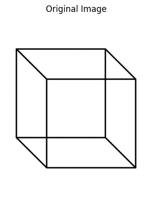
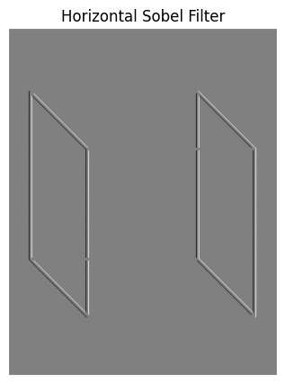
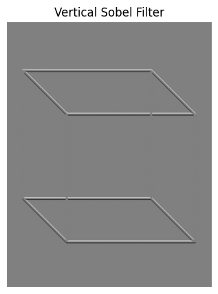
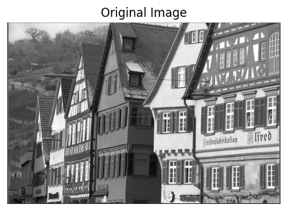
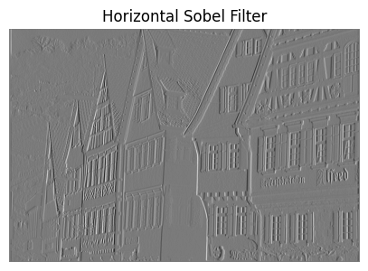
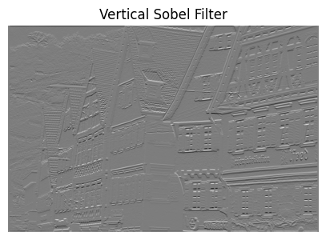
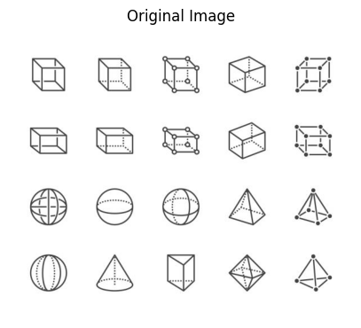
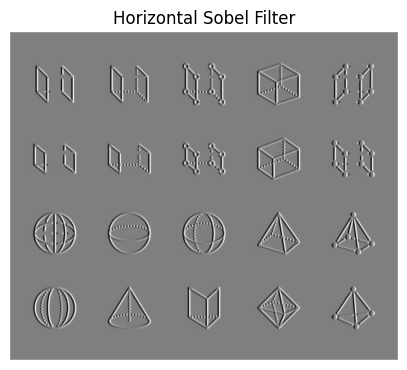
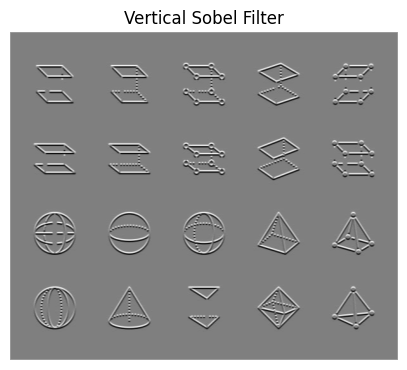

# Edge Detection

In this file, I have mentioned the results of various edge detection algorithms.

## Sobel Edge Detection

<table>
<tr>
    <th>Original Image</th>
    <th>Verical Edge Detection</th>
    <th>Horizontal Edge Detection</th>
</tr>
<tr>
    <td>
    
    </td>
    <td>
    
    </td>
    <td>
    
    </td>
</tr>
<tr>
    <td>
    
    </td>
    <td>
    
    </td>
    <td>
    
    </td>
</tr>
<tr>
    <td>
    
    </td>
    <td>
    
    </td>
    <td>
    
    </td>
</tr>
</table>
